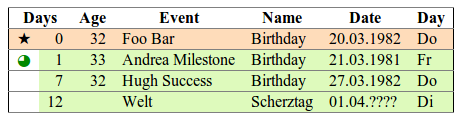

*********************************
bdrem - Birthday reminder by mail
*********************************
Birthday reminder that sends out e-mails.

It can also generate ASCII tables on your console/shell and normal HTML pages.

.. contents::

========
Features
========

Data sources
============
- Any SQL database.

  - Multiple date fields per record supported.
- An LDAP server
- `Birthday reminder <http://cweiske.de/birthday3.htm>` files (``.bdf``)

Output formats
==============
- ASCII table
- HTML
- Email (text + HTML parts)
- iCalendar

=====
Usage
=====

Command line
============
After configuration_, you can test and use *bdrem* via command line::

    $ bdrem
    -----------------------------------------------------------
    Days  Age  Name                  Event      Date        Day
    -----------------------------------------------------------
       0   32  Foo Bar               Birthday   20.03.1982  Do 
       1   33  Andrea Milestone      Birthday   21.03.1981  Fr 
       7   32  Hugh Success          Birthday   27.03.1982  Do 
      12       Welt                  Scherztag  01.04.????  Di

Help
----
To find out about all supported command line options, use ``--help``::

    Usage:
      ./bin/bdrem.php [options]
      ./bin/bdrem.php [options] <command> [options]
    
    Options:
      -n NUM, --next=NUM                Show NUM days after date
      -p NUM, --prev=NUM                Show NUM days before date
      -r renderer, --renderer=renderer  Output mode
      --list-renderer                   lists valid choices for option renderer
      -e, --stoponempty                 Output nothing when list is empty
      -d date, --date=date              Date to show events for
      -c FILE, --config=FILE            Path to configuration file
      -h, --help                        show this help message and exit
      -v, --version                     show the program version and exit
    
    Commands:
      readme  Show README.rst file
      config  Extract configuration file

E-Mail
======
To send birthday reminder e-mails, use the ``mail`` renderer::

    $ bdrem --renderer=mail

If you only want an email if there is a birthday, use ``--stoponempty``::

    $ bdrem --renderer=mail --stoponempty

Make sure your config file contains ``$mail_from`` and ``$mail_to`` settings.

iCalendar
=========
Exporting birthday events into an ``.ics`` file is easy::

   $ bdrem --renderer=ical > birthdays.ics

It is possible to access the calendar via HTTP, too::

    http://example.org/bdrem/?renderer=ical

You can subscribe to it in your calendar or email application.
Integration has been tested with Thunderbird's Lightning__ and Claws Mail's
vCalendar__ plugin.

__ https://addons.mozilla.org/en-US/thunderbird/addon/lightning/
__ http://www.claws-mail.org/plugin.php?plugin=vcalendar

HTML page
=========
Simply point your web browser to the ``.phar`` file, or ``index.php``.
You will get a colorful HTML table:

=============
Configuration
=============
Copy ``data/bdrem.config.php.dist`` to ``data/bdrem.config.php`` and
adjust it to your liking.

When running the ``.phar``, extract the configuration file first::

    $ php dist/bdrem-0.1.0.phar config > bdrem-0.1.0.phar.config.php

Birthday file
=============
If you have a ``.bdf`` file from `birthday reminder`__ or `birthday reminder 3`__,
you can use it with *bdrem*.

Configure your source as follows::

    $source = array('Bdf', '/path/to/birthday.bdf');

__ http://cweiske.de/birthday.htm 
__ http://cweiske.de/birthday3.htm 

LDAP server
===========
*bdrem* can read birthdays and other events from persons in an LDAP server.
It is known to work fine with ``evolutionPerson`` objects.
Attributes ``birthDate`` and ``anniversary`` are read.

Configure it as follows::

    $source = array(
        'Ldap',
        array(
            'host'   => 'ldap.example.org',
            'basedn' => 'ou=adressbuch,dc=example,dc=org',
            'binddn' => 'cn=FIXME,ou=users,dc=example,dc=org',
            'bindpw' => 'FIXME'
        )
    );

SQL database
============
Events can be fetched from any SQL database supported by PHP's
PDO extension - MySQL, SQLite, PostgreSQL and so on.

You may configure every little detail of your database::

    $source = array(
        'Sql',
        array(
            'dsn' => 'mysql:dbname=bdrem;host=127.0.0.1',
            'user' => 'FIXME',
            'password' => 'FIXME',
            'table' => 'contacts',
            'fields' => array(
                'date' => array(
                    //column name => event title
                    'c_birthday' => 'Birthday'
                ),
                //column with name, or array with column names
                'name' => array('c_name'),
                //sprintf-compatible name formatting instruction
                'nameFormat' => '%s',
            )
        )
    );

MS SQL server
-------------
Configure the date format in ``/etc/freetds/locales.conf``::

    [default]
        date format = %Y-%m-%d

Also set the charset to UTF-8 in ``/etc/freetds/freetds.conf``::

    [global]
        # TDS protocol version
        tds version = 8.0
        client charset = UTF-8

Restart Apache afterwards.

Use ``dblib`` in the DSN::

    dblib:host=192.168.1.1;dbname=Databasename

============
Dependencies
============
- PHP 5.3 or higher
- PDO
- PEAR packages:

  - `Console_Color2 <https://pear.php.net/package/Console_Color2>`_
  - `Console_CommandLine <https://pear.php.net/package/Console_CommandLine>`_
  - `Console_Table <https://pear.php.net/package/Console_Table>`_
  - `Mail_mime <https://pear.php.net/package/Mail_mime>`_
  - `Net_LDAP2 <https://pear.php.net/package/Net_LDAP2>`_

=======
License
=======
``bdrem`` is licensed under the `AGPL v3`__ or later.

__ http://www.gnu.org/licenses/agpl.html

========
Homepage
========
Web site
   http://cweiske.de/bdrem.htm

Source code
   http://git.cweiske.de/bdrem.git

   Mirror: https://github.com/cweiske/bdrem

======
Author
======
Written by Christian Weiske, cweiske@cweiske.de
